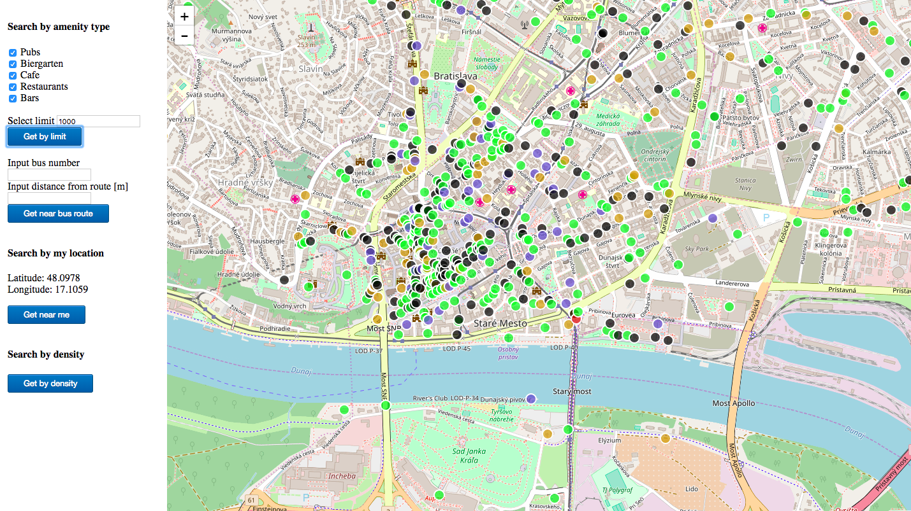
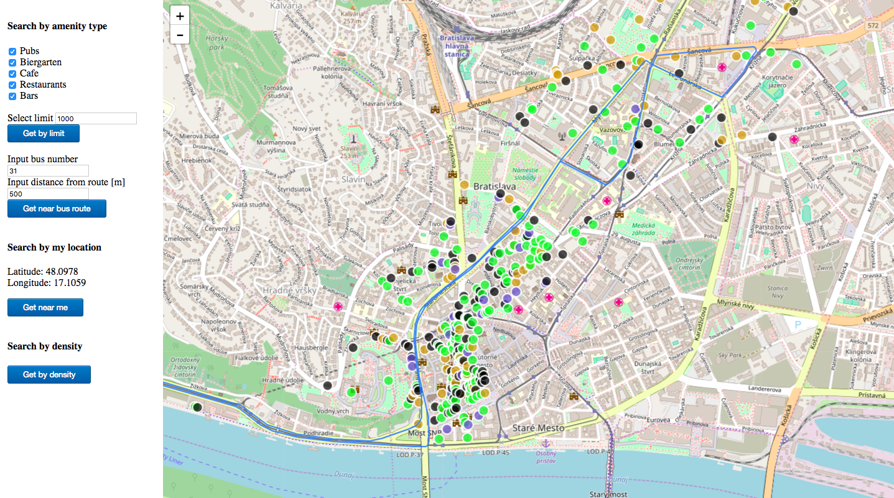

# Overview

This application shows pubs, restaurants, cafes, bars and biergartens in Bratislava on a map. Most important features are:
- search by proximity to my current location
- search by amenity type
- search near a bus route
- amenities on the map are color coded by their type
- visualization of city by choroplothing the areas based on the density of selected amenities 

This is search in action:



This is search near bus route in action:



The application has 2 separate parts, the client which is a frontend web application using leaflet.js,
with bootleaf and bootstrap for graphics rendering. The backend application is written in PHP backed by PostGIS from PDT labs. T
he frontend application communicates with backend using AJAX calls.

# Frontend

The frontend application is a static HTML page (`index.html`), which shows a leaflet.js widget. 
It is displaying given number of color coded amenities, based on their type which selects the user. 
Another feature is searching by location of the user which is achieved by HTML5 geolocation functionality.
The user can also search for amenities in a given distance near a route of public transport vehicle. The route is then visualized
with the amenities on the map. I also managed to choroploth the city areas to ease the user selection of city area
which contains the most amenities.

All relevant frontend code is in `map_controls.js` which is referenced from `index.html`. The frontend code is very simple, its only responsibilities are:
- detecting user's location, using the standard HTML5 location API
- displaying the sidebar panel where the user selects his preferences and searches based on his desired scenario
- displaying geo features by overlaying the map with a geojson layer, the geojson is provided directly by backend APIs

# Backend

The backend application is written in PHP and is responsible for querying geo data, 
formatting the geojson and sending the data via AJAX to the map.

## Data

Amenity data is coming directly from the docker file database from course lab nr. 3. 


## Api

Based on the clicked button the frontend sends AJAX request to the backend which elects given procedure based on the clicked
button value. The backend then sends response encoded in geojson which is then interpreted by frontend leaflet map element.

### Response

Backend calls return AJAX response by selected rows which is then parsed into leaflet feature properties for visualisation
the map points and lines.
 
```
U rytiera, 
{
	"type":"Point",
	"coordinates":[16.9786331,48.1753056]
},
pub,
```
